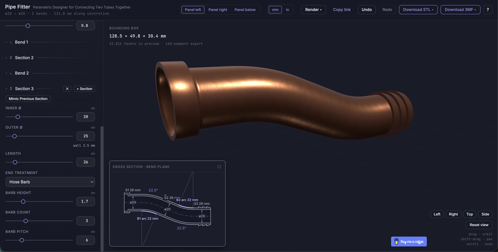
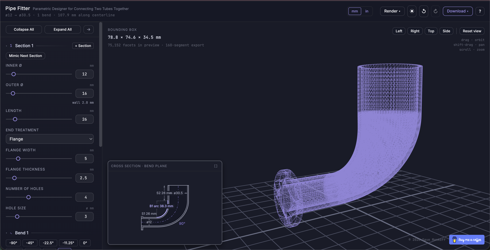
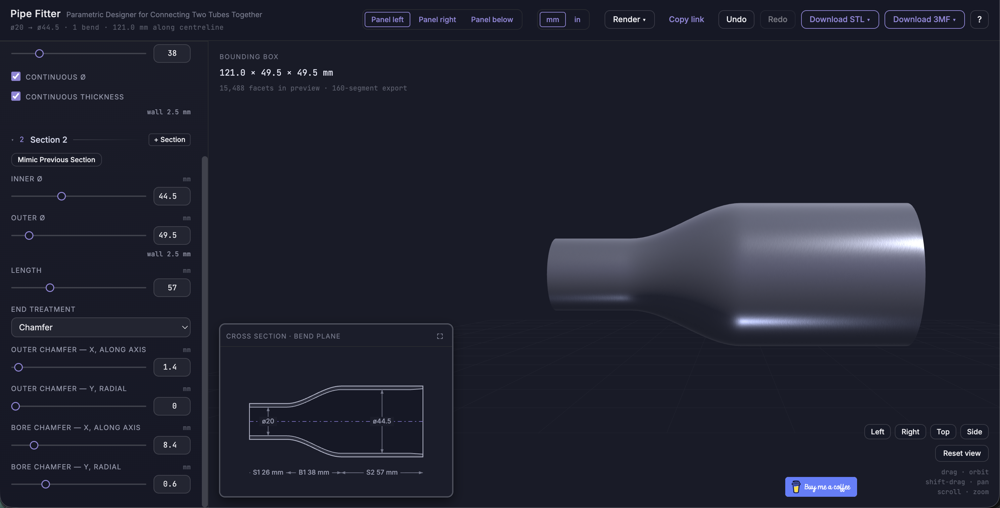
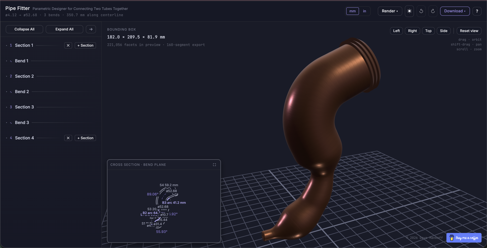

# Pipe Fitter

A single-page web app for designing 3D-printable **pipe adapters** and exporting them
as STL or 3MF. You describe a pipe as a chain of straight **sections** joined by optional
**bends**, set each end's treatment, and the app builds a live, watertight 3D model
plus an annotated 2D cross-section — all in the browser, with no server, no accounts,
and no build step.

It's meant for makers who need a transition between two tubes (a hose to a pipe, one
diameter to another, a bent run between fixed ports) and want a printable part in a
minute rather than a full CAD session.

[View It Live](https://mankyd.github.io/pipefitter/)

## What it can do

- **Any number of sections** — from a single straight run upward — each with its own
  inner diameter, wall thickness, and length, joined by planar bends of up to 90 degrees.
- **End treatments** on each pipe's two open ends: plain, chamfer, flange (with bolt
  holes), hose barb, teeth, and a slip joint for sliding two pipes together. A lone
  section carries both of them, one per side.
- **Up to four separate pipes** joined end to end by a flange, slip joint, or butt joint,
  shown assembled. Each joint keeps its two mating ends in agreement — diameters, and a
  flange's bolt pattern — while leaving each part its own wall thickness and tolerance.
- **Live 3D preview** (orbit / pan / zoom, multiple render styles) and a **live 2D
  cross-section** with dimensions.
- **Export** to binary STL or 3MF, optionally oriented to sit flat on an end face. A
  multi-pipe design exports as a ZIP of one STL per part, or a single multi-object 3MF.
- **Everything lives in the URL** — the full design, display units (mm/in), render
  style, camera pose, and panel state — so the URL reproduces exactly what you see.

For how to use each control, open the in-app help (the **?** button); or read 
[`HELP.md`](HELP.md).

<table>
  <tbody>
    <tr>
      <td width="25%" align="center" valign="top">
        <a href="assets/screenshot_a.png">
          
        </a>
      </td>
      <td width="25%" align="center" valign="top">
        <a href="assets/screenshot_b.png">
          
        </a>
      </td>
      <td width="25%" align="center" valign="top">
        <a href="assets/screenshot_c.png">
          
        </a>
      </td>
      <td width="25%" align="center" valign="top">
        <a href="assets/screenshot_d.png">
          
        </a>
      </td>
    </tr>
    <tr>
      <td align="center" valign="top">
        <small><a href="https://mankyd.github.io/pipefitter/#s=12~2~26|34.5~2.5~26&b=0~22~16~2.2~1~1&e0=plain&eN=plain&view=0,1.571,157.8,0,23,0">Simple Pipe</a></small>
      </td>
      <td align="center" valign="top">
        <small><a href="https://mankyd.github.io/pipefitter/#s=12~2~26|30.5~2~26&b=90~38.3~16~2.2~1~1&e0=flange~5~2.5~4~3&eN=plain&render=wire&view=-0.625,1.448,163.2,-2.7,39.5,5.6">Wireframe of Bent Pipe</a></small>
      </td>
      <td align="center" valign="top">
        <small><a href="https://mankyd.github.io/pipefitter/#s=4.12~5.29~11.56|15.44~13.27~5.34|52.68~9.63~20.17|52.68~9.63~59.2&b=55.93~66.3~32.19~9.68~0~0|56.92~64.7~9.92~6.19~0~1|-89.06~41.2~9.83~5.73~1~1&e0=chamfer~1.4~0.7~1.2~0.6&eN=barb~5~3~6&render=copper&expanded=1&view=-0.52,1.316,478.5,47.2,152.8,24.6">Cross Section of Crazy Pipe</a></small>
      </td>
      <td align="center" valign="top">
        <small><a href="https://mankyd.github.io/pipefitter/#s=4.12~5.29~11.56|15.44~13.27~5.34|52.68~9.63~20.17|52.68~9.63~59.2&b=55.93~66.3~32.19~9.68~0~0|56.92~64.7~9.92~6.19~0~1|-89.06~41.2~9.83~5.73~1~1&e0=chamfer~1.4~0.7~1.2~0.6&eN=barb~5~3~6&render=copper&view=-0.52,1.316,456.2,36.5,158.4,43.3">Rendering of Crazy Pipe</a></small>
      </td>
    </tr>
  </tbody>
</table>

## Running it

There is **no build step and nothing to install** — it's plain HTML, CSS, and JS.
It's only dependencies are three.js and a few fonts, all of which is bundled. You need
to serve the folder over HTTP, because ES-module imports don't work from `file://`.

```
    python -m http.server 8000
```
or 
```
    npx http-server -p 8000
```

or your server of choice.

Then open http://localhost:8000.

## Files

These must all be served together, with their relative paths preserved:

| Path | Purpose |
| --- | --- |
| `index.html` | Entry point; wires up the layout and loads `app.js` as a module. |
| `app.js` | Application: UI, panel, camera, exports, URL state. |
| `pipe-geometry.js` | All CAD math + the binary STL / 3MF writers. Dependency-free ES module. |
| `pipe-diagram.js` | The 2D cross-section schematic (Canvas 2D). |
| `app.css` | Application styles. |
| `dark.css` | Design-system stylesheet (tokens + components). |
| `HELP.md` | In-app help text, fetched at runtime for the **?** dialog. |
| `vendor/three.module.js` | three.js r160 (MIT), the only third-party runtime dependency. |
| `fonts/fonts.css` | `@font-face` rules. |
| `fonts/*.woff2` | Inter and JetBrains Mono (latin / latin-ext subsets). |
| `assets/buymeacoffee.png` | Support-link logo. |

## How it works (briefly)

- `pipe-geometry.js` sweeps a per-station inner/outer profile along a planar centerline
  and triangulates a closed mesh; `build(params, segments)` returns positions, indices,
  a bounding box, a 2D silhouette, and clamp notes. It's pure, with no DOM or three.js
  dependency.
- `app.js` memoizes the geometry on the parameter signature, renders it with three.js,
  draws the schematic via `pipe-diagram.js`, and mirrors the whole state into the URL
  hash. Every input is clamped, never rejected, so the model is always valid and
  exportable.

## License

MIT — see [`LICENSE.md`](LICENSE.md). Third-party components retain their own licenses;
see [`CREDITS.md`](CREDITS.md).
